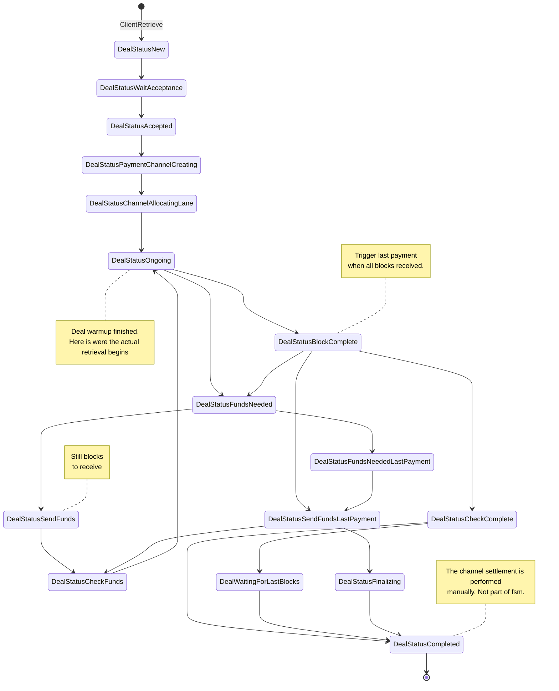
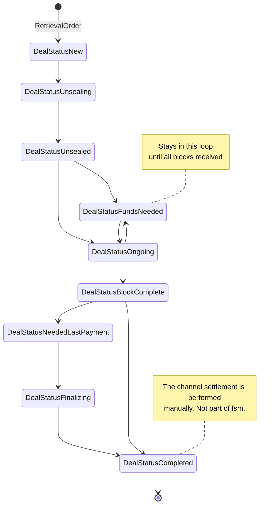

# State machine designs

## Pay-per-chunk
### Client

```mermaid
stateDiagram-v2
[*] --> DealStatusNew: ClientRetrieve
DealStatusNew --> DealStatusWaitAcceptance
DealStatusWaitAcceptance --> DealStatusAccepted
DealStatusAccepted --> DealStatusPaymentChannelCreating
DealStatusPaymentChannelCreating --> DealStatusChannelAllocatingLane
DealStatusChannelAllocatingLane --> DealStatusOngoing
note right of DealStatusOngoing
Deal warmup finished.
Here is were the actual retrieval begins
end note

DealStatusOngoing --> DealStatusFundsNeeded
DealStatusFundsNeeded --> DealStatusSendFunds
DealStatusSendFunds --> DealStatusCheckFunds
DealStatusCheckFunds --> DealStatusOngoing
DealStatusOngoing --> DealStatusBlockComplete

note left of DealStatusBlockComplete
Trigger last payment
when all blocks received.
end note
DealStatusBlockComplete --> DealStatusSendFundsLastPayment
DealStatusBlockComplete --> DealStatusFundsNeeded
DealStatusBlockComplete --> DealStatusCheckComplete
DealStatusCheckComplete --> DealStatusCompleted
DealStatusCheckComplete --> DealWaitingForLastBlocks
DealStatusFundsNeededLastPayment --> DealStatusSendFundsLastPayment
DealStatusFundsNeeded --> DealStatusFundsNeededLastPayment
DealStatusSendFundsLastPayment --> DealStatusCheckFunds
DealStatusSendFundsLastPayment --> DealStatusFinalizing
DealWaitingForLastBlocks --> DealStatusCompleted
DealStatusFinalizing --> DealStatusCompleted
DealStatusCompleted --> [*]

note left of DealStatusSendFunds
Still blocks
to receive
end note

note left of DealStatusCompleted
The channel settlement is performed
manually. Not part of fsm.
end note

```

### Provider

```mermaid
stateDiagram-v2
[*] --> DealStatusNew: RetrievalOrder
DealStatusNew --> DealStatusUnsealing
DealStatusUnsealing --> DealStatusUnsealed
DealStatusUnsealed --> DealStatusFundsNeeded
DealStatusUnsealed --> DealStatusOngoing
DealStatusFundsNeeded --> DealStatusOngoing
DealStatusOngoing --> DealStatusFundsNeeded
note left of DealStatusFundsNeeded
Stays in this loop
until all blocks received
end note
DealStatusOngoing --> DealStatusBlockComplete
DealStatusBlockComplete --> DealStatusNeededLastPayment
DealStatusNeededLastPayment --> DealStatusFinalizing
DealStatusFinalizing --> DealStatusCompleted
DealStatusBlockComplete --> DealStatusCompleted
DealStatusCompleted --> [*]

note left of DealStatusCompleted
The channel settlement is performed
manually. Not part of fsm.
end note
```